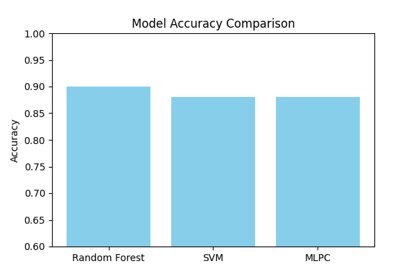
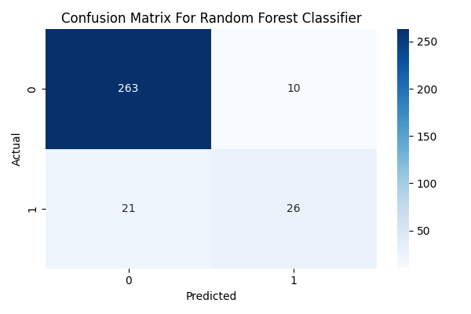
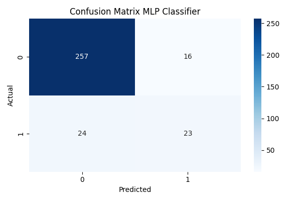
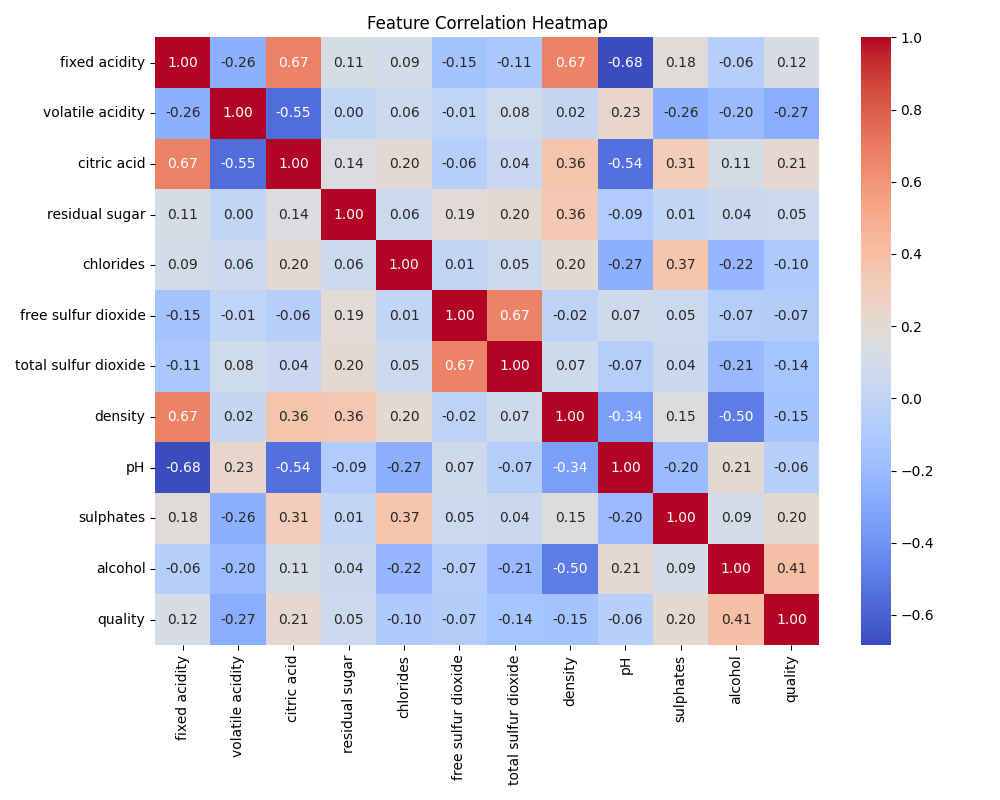
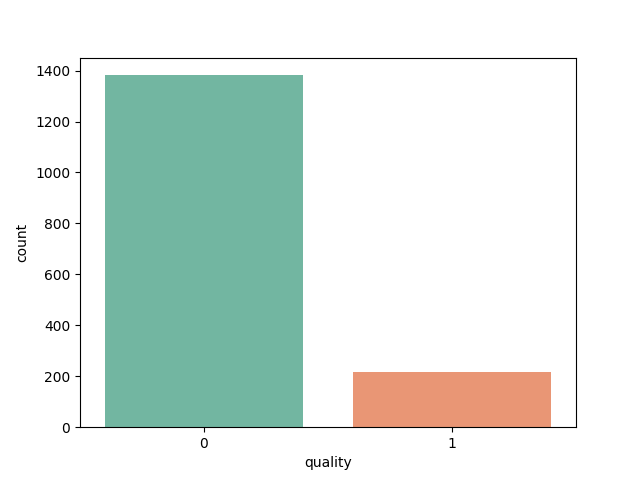

# Wine Quality Prediction

This project involves building and evaluating classification models to predict wine quality using physicochemical test results. The goal is to analyze patterns, visualize correlations, and implement machine learning models to classify wine into quality categories.

## Overview

- Dataset: Wine Quality Dataset (UCI Machine Learning Repository)
- Target Variable: Wine quality score (0–10, binned into categories)
- Features: Fixed acidity, volatile acidity, citric acid, residual sugar, chlorides, etc.
- Problem Type: Multi-class classification
- Models Used:
  - Random Forest Classifier
  - Support Vector Machine (SVC)
  - Multi-Layer Perceptron Classifier (MLPC)

## Objectives

- Understand feature relationships using correlation analysis
- Visualize the distribution of wine quality
- Train multiple classifiers
- Compare model performance using confusion matrices and accuracy scores

## Model Evaluation

Model performance was compared using accuracy and confusion matrix visualizations.

### [Model Accuracy Comparison](assets/model_accuracy.png)

### Confusion Matrices

- [Random Forest Classifier](assets/confusion_matrix_rcf.png)  
  

- [Support Vector Classifier (SVC)](assets/confusion_matrix_clf.png)  
  

- [Multi-Layer Perceptron Classifier (MLPC)](assets/confusion_matrix_mlpc.png)  
  

## Exploratory Data Analysis

### [Feature Correlation Heatmap](assets/feature_correlation.png)

Illustrates relationships between physicochemical properties.  

### [Wine Quality Label Distribution](assets/wine_quality_label.png)

Shows the distribution of wine samples across quality labels.  

## Author

**Kwabena Mensah Sarpong**  
GitHub: [sarpongkm](https://github.com/sarpongkm)

---

